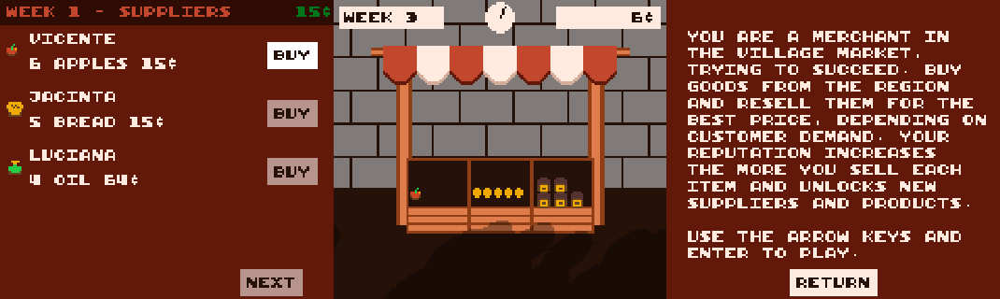

# Market Street Tycoon

## A js13kgames game



Become the most successful merchant in the kingdom!

Market Street Tycoon is a game about building up a successful business in mediaeval Europe, selling a variety of products for the best price. The more you sell your products, the more your reputation increases. This unlocks new possibilities, and your costumers are more willing to pay you more for your quality goods. There are 9 products to unlock: 🍎 🍞 🪵 🥚 🥧 🏺 💎 🌶.

Game works on desktop or mobile. Use WASD or arrow keys and Enter, or gamepad. On mobile, use the virtual gamepad.

🎮 [Play Game](https://lopis.github.io/market-street-tycoon/dist/)

📃 [A tiny pixel art game using no images](https://dev.to/mrlopis/a-tiny-pixel-art-game-using-no-images-49df)

## Development

Install dependencies

```sh
yarn
```

Run development

```sh
yarn dev
```

Build a new version

```sh
sudo apt install default-jre # Needed to run roadroller
yarn build-with-best-roadroller
```

## Credits

Music adapted from <https://musescore.com/user/26822/scores/44875>

Roadroller setup by [Rob Louie](@roblouie)
